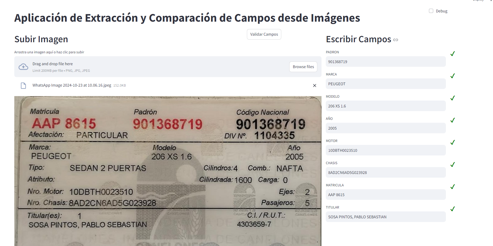
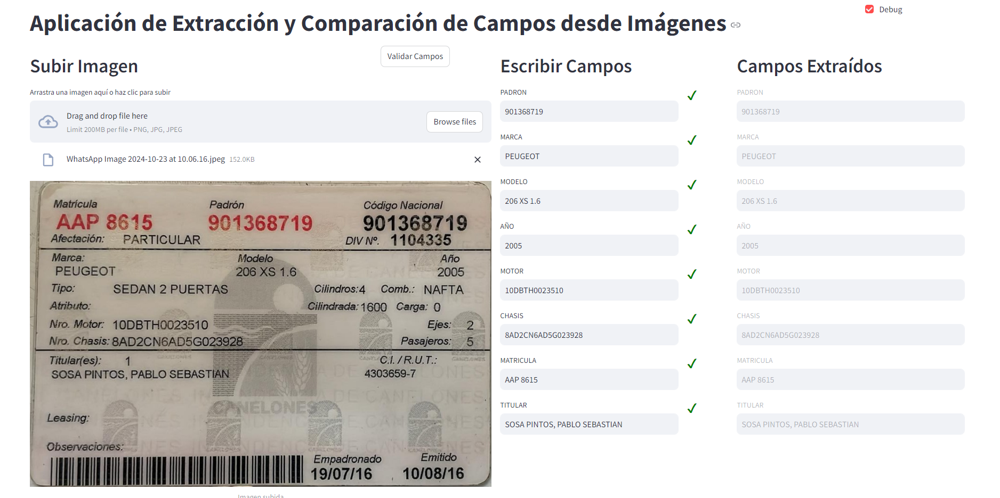

# Proyecto de Validación de Datos en Libretas


## Requisitos

Es necesario tener python3 instalado en la computadora. 

Para instalar las librerias necesarias, ejecute el siguiente comando:

```bash
pip install -r requirements.txt
```

## Ejecución de la Aplicación

Para ejecutar la aplicación, situarse en la carpeta raíz del proyecto y correr el siguiente comando:

```bash
streamlit run app.py
```

Esto levanta en un puerto local la aplicación, la cual puede ser ejecutada en cualquier navegador.

## Uso de la Aplicación

### Modo Normal

La pantalla principal de la aplicación consiste en dos sectores:

- Subir Imagen: Permite subir una imagen con una libreta de propiedad. De esta imagen se extraeran los campos de interes
- Escribir Campos: Permite escribir los campos a validar. Una vez escritos todos los campos, clickear en "Validar Campos" para validar cual campo esta correctamente rellenado respecto a la imagen provista.  




### Modo Debug

El modo debug se activa clickeando en el icono de debug en la parte superior derecha de la pantalla. Esto agrega una nueva sección la cual muestra los Campos Extraidos. En esta sección se muestran los campos extraidos de la imagen durante el procesamiento de la imagen de forma de asegurarse que el modelo de extracción de datos funcione correctamente. 



## Casos de Prueba

A su vez, se dejan disponibles varias imagenes de libretas de propiedad en la carpeta `data` para utilizar como casos de prueba.